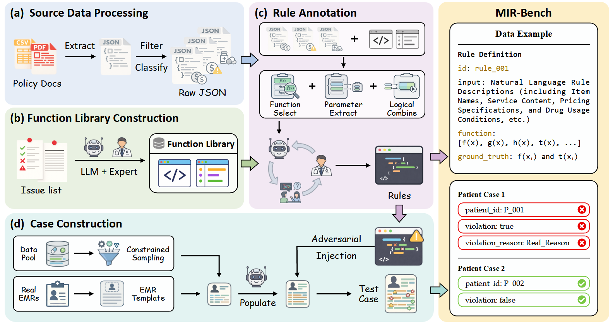

# T2ER: A Chinese Benchmark for Text-to-Executable-Rule Generation in Medical Insurance

## 📖 Abstract

Medical insurance plays a pivotal role in the healthcare system, where effective supervision relies on the precise execution of complex Medical Insurance Rules. Existing solutions for medical insurance violation detection mainly rely on costly manual labor, resulting in limited efficiency. Although current LLMs have demonstrated significant potential in general NLP tasks, they still struggle to understand these rules, and a corresponding evaluation benchmark is lacking. Hence, we propose T2ER, a benchmark to evaluate the capability of LLMs in converting texts into executable rules in medical insurance. T2ER consists of 2,115 rules and 5,636 synthetic EMR test cases for execution verification. Furthermore, we design a dual evaluation framework spanning rule and execution levels to comprehensively assess transformation quality. We conduct extensive experiments on advanced LLMs. The results reveal a significant human-AI performance gap, indicating that this conversion remains a formidable challenge. The dataset is available at https://anonymous.4open.science/r/T2ER-8921.

## Ethical Consideration

Our benchmark raises no privacy concerns. All rule texts are extracted from publicly released medical insurance policy documents, and all EMRs are fully synthetic and contain no personally identifiable information. Therefore, MIR-Bench does not involve real individuals, sensitive attributes, or unauthorized data use, and we are not aware of other ethical issues arising from the dataset.
